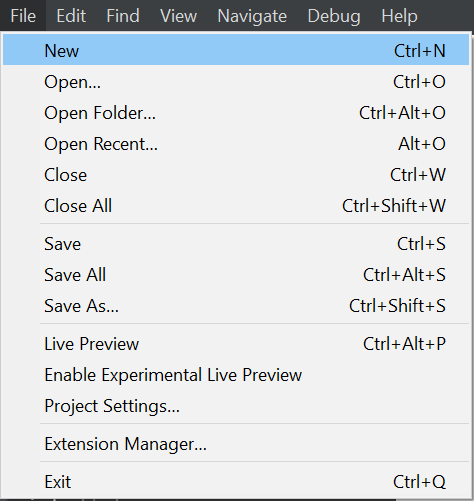
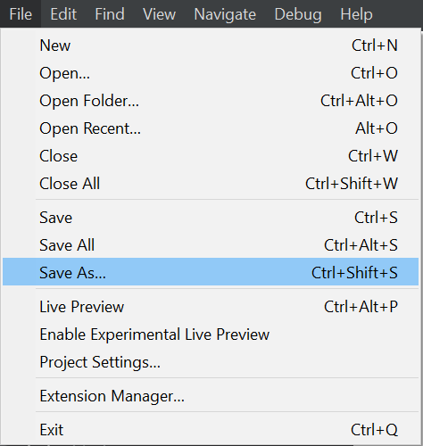
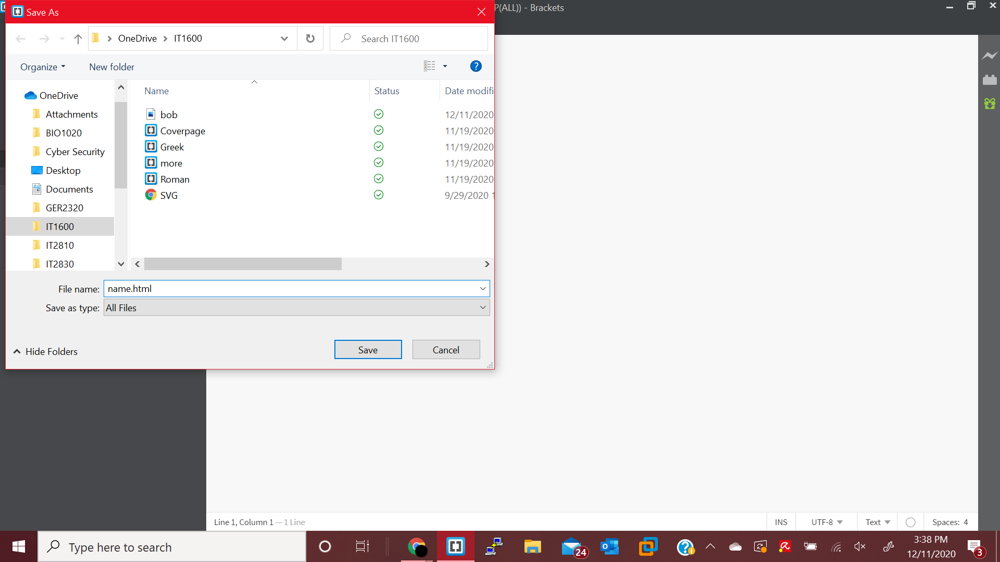

## 1. The first thing you must do is to download a plain text editor so that you can write code.

-There are many different types of text editors out there but I prefer to use the free program Brackets.

-Follow this link to download [Brackets](http://brackets.io/).

## 2. Next open Brackets and create an HTML file.
-Open a new file and then click save as. When prompted enter the file name of your choice followed by the ".html" extension.

    

## 3. Now it is time to set up the HTML document, every HTML document must be set up the same way:
-HTML has 5 required tags:
[tags](tags.png)

