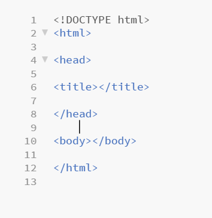

## 1. Download Plain Text Editor.

-There are many different types of text editors out there but I prefer to use the free program Brackets since when you write a tag it automatically adds the end tag.

-Follow this link to download [Brackets](http://brackets.io/).

## 2. Create an HTML file.
-Open Brackets and create a new file, then click save as. When prompted enter the file name of your choice followed by the ".html" extension and then save.

    


## 3. HTML Document structure:
-There are 5 required tags in an HTML file:



-Inside the head tag add the language identifier for english. 

-Then add the style tag within the head element, this will be used to add CSS style later.

-inside the title tag write your title, this is what will be the title of the web page. 

```
<head lang="en">
<title> Title </title>
<style></style>
<head>
```
## 4. Creating the SVG image.
-Start by adding an SVG tag inside the body tag.

-Give the svg element the id of "box" which we will use to give the element specific CSS later. the height and width create a box that can house svg content.
```
<body>
<svg id="box" height="600" width="700">
</svg>
<body>
```
-To create the stick figure you must add a series of shapes inside the svg element. 

-the x and y coordinates determine where in the svg box the shapes will be. 

**-It is very important to have the svg box height and width the same as I have above otherwise the figure will be distorted.**

-There is also some inline CSS that cannot be added under the "<style>" tag so it must be put in the shape tags.
     
```
<circle cx="350" cy="100" r="40" stroke="black" stroke-width="5" fill="white"></circle>  
     
   
<line x1="350" x2="350" y1="140" y2="280" stroke="black" stroke-width="5"></line> 
     
     
     <line x1="350" x2="310" y1="165" y2="210" stroke="black" stroke-width="5"></line>
     
      <line x1="350" x2="390" y1="165" y2="210" stroke="black" stroke-width="5"></line>
  
 <line x1="350" x2="315" y1="278" y2="340" stroke="black" stroke-width="5"></line>
     
<line x1="350" x2="390" y1="278" y2="340" stroke="black" stroke-width="5"></line>
```
