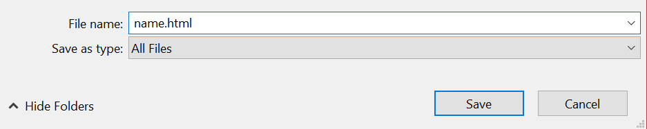

## 1. The first thing you must do is to download a plain text editor so that you can write code.

-There are many different types of text editors out there but I prefer to use the free program Brackets since when you write a tag it automatically adds the end tag.

-Follow this link to download [Brackets](http://brackets.io/).

## 2. Next open Brackets and create an HTML file.
-Open a new file and then click save as. When prompted enter the file name of your choice followed by the ".html" extension.

    



## 3. Now it is time to set up the HTML document, every HTML document must have 5 required tags:


-Inside the head tag add the language identifier for english. 

-Then add the style tag within the head element, this will be used to add CSS style later.

-Next add a title tag inside the head tag, this is what will be the title of the web page. 

```
<head lang="en">
<title> Title </title>
<style></style>
<head>
```
## 4. Creating the SVG image.
-Start by adding an SVG tag inside the body tag.

-Give the svg element the id of "box" which we will use to give the element specific CSS later. the height and width create a box that can house svg content.
```
<body>
<svg id="box" height="600" width="700">
</svg>
<body>
```
